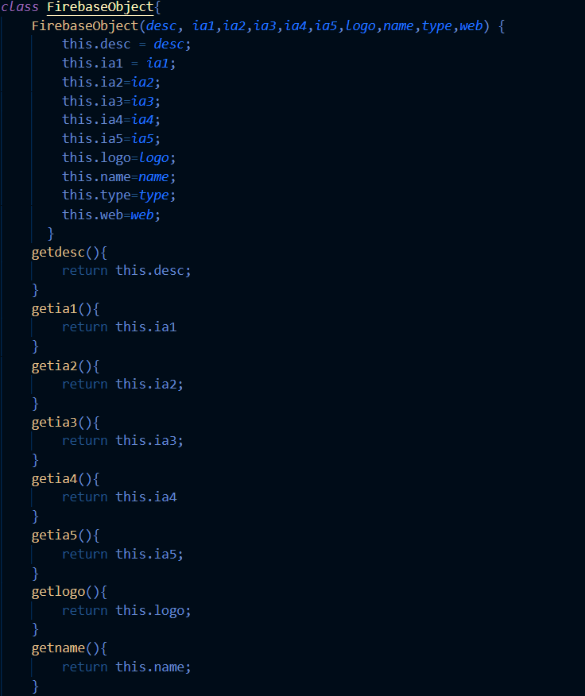
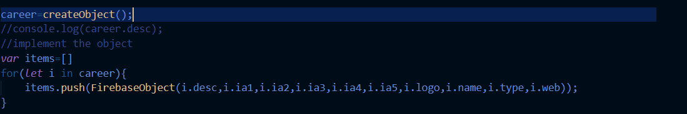

# SICTC College and Career Fair Website

**Table of Contents**
1. [Overview](#overview)  
       &nbsp;&nbsp; a. [What each file does](#what-each-file-does)  
       &nbsp;&nbsp; b. [The Process](#the-process)
3. [Pushing information to Firebase](#pushing-information-to-firebase)
4. [Pulling information from Firebase](#pulling-information-from-firebase)
5. [Displaying information to the website using javascript](#displaying-information-to-the-website-using-javascript)
6. [CORS Error](#cors-error)
7. [Creating an object from the Firebase](# Creating an object from the Firebase)


## Overview

### What each file does

The SICTC College and Career Fair Website, which throughout this documentation will be called CCF, is comprised of four main parts.
  1. index.html - The main html file that is used to display the website.
  2. get.js - The main javascript file which retrieves information from firebase and builds each card (each college/company).
  3. addCard.html - An html file which has a form used to submit information neatly to firebase.
  4. bootstrap.css - An [open-source CSS style sheet](https://getbootstrap.com/) used for styling throughtout the CCF website.

A "card" is each visibly distinguisable section comprised of a college or company on the webpage.

### The Process

In order to add a new college/company:
  1. Open the addCard.html file
  2. Fill out the form and click submit

The newly pushed data will immediately be displayed on the main page. If not, refresh the page.

No action is required to display new information because the website updates when a firebase value is changed or added.

## Pushing information to Firebase

Any new college/company is added through the addCard.html file, a basic html form that has been formatted with bootstrap. This allows information to added easily and effciently without having to add it manually in firebase.

</img>

A static firebase script needs to be ran in order to help with initialzation of firebase into the code.

```js
<script src="https://www.gstatic.com/firebasejs/3.7.4/firebase.js"></script>
```

A firebaseConfig variable is made to store the api information to connect to the firebase.
The CCF website's config variable looks like this:
```js
var firebaseConfig = {
		apiKey: "AIyaSyAnbiYMGExQslJ9styiklG-WPIp6vFBIbE",
		authDomain: "sictc-career-fair.firebaseapp.com",
		projectId: "sictc-career-fair",
		storageBucket: "sictc-career-fair.appspot.com",
		messagingSenderId: "513234127322",
		appId: "1:513434627352:web:bc29fecd5ceeea674b3943",
		measurementId: "G-1GKEYRNJXY",
		databaseURL: "https://sictc-career-fair-default-rtdb.firebaseio.com/"
		};
```
This information is provided when setting up a database for html applications. [See here](https://medium.com/evenbit/getting-started-with-firebase-real-time-database-for-the-web-f53b527aae27)
You may need to add the databaseURL section to the config. This can be done by going to "Realtime Database" then copying the link that appears just above the values in the database.

Then the firebase is initialized, meaning it connects into your code.
```js
firebase.initializeApp(firebaseConfig);
```

A reference is made to the "Items" catagory so that it pushes information to the same area.
```js
var itemsRef = firebase.database().ref('Items');
```

An event listener is also placed on the form (infoForm) so that the information is pushed when, and only when, the user presses submit.
The event lister listens for the "submit" id, and then runs submitForm function.
```js
document.getElementById('infoForm').addEventListener('submit', submitForm);
```

Once the user clicks submit:
  1. The embedded javascript code grabs the information of each form element using their ids and stores each one in a variable.

  2. These variables are then passed into the saveMessage function and the form is reset.
```js
function submitForm(e) {e.preventDefault();
	var name = getInputVal('name');
	var logo = getInputVal('logo');
        var web = getInputVal('web');
        var desc = getInputVal('desc');
	var ia1 = getInputVal('ia1');
	var ia2 = getInputVal('ia2');
	var ia3 = getInputVal('ia3');
	var ia4 = getInputVal('ia4');
	var ia5 = getInputVal('ia5');
	var type = getInputVal('type')

	saveMessage(name,logo,web,desc,ia1,ia2,ia3,ia4,ia5,type);
	document.getElementById('infoForm').reset();
}

// Function to get get form values
function getInputVal(id) {
	return document.getElementById(id).value;
}
   ```

  3. The saveMessage function then makes a firebase reference (a reference id stored in a variable unique to each college/company).
  
  4. This new reference is then set with the form variables we passed in earlier in the form of a dictionary with key:value pairs.

  5. The .set() method automatically pushes this information to firebase with a unique reference that was made earlier.
  ```js
  function saveMessage(name,logo,web,desc,ia1,ia2,ia3,ia4,ia5,type) {
	var newMessageRef = messagesRef.push();
	newMessageRef.set({
	      name: name,
          logo: logo,
          web: web,
          desc: desc,
		ia1: ia1,
		ia2: ia2,
		ia3: ia3,
		ia4: ia4,
		ia5: ia5,
		type: type,
       });
}
  ```

## Pulling information from Firebase

Information in the CCF Website is pulled by using a javascript (get.js) file that writes out each individual card into the index.html file. Basically, for each college/company in the database, it will build out a card with all of its information and add it onto the previous cards.

The first thing to do, similarly to the addCard.html file, is to import a static script in order to help with the initialzation of firebase.
```js
import { initializeApp } from "https://www.gstatic.com/firebasejs/9.0.2/firebase-app.js";
```

Next, the firebaseConfig variable is defined and firebase is initialized. 
```js
var firebaseConfig = {
		apiKey: "AIyaSyAnbiYMGExQslJ9styiklG-WPIp6vFBIbE",
		authDomain: "sictc-career-fair.firebaseapp.com",
		projectId: "sictc-career-fair",
		storageBucket: "sictc-career-fair.appspot.com",
		messagingSenderId: "513234127322",
		appId: "1:513434627352:web:bc29fecd5ceeea674b3943",
		measurementId: "G-1GKEYRNJXY",
		databaseURL: "https://sictc-career-fair-default-rtdb.firebaseio.com/"
		};
		
firebase.initializeApp(firebaseConfig);
var database = firebase.database();
```

The database variable is made so that firebase.database() can be condense and it makes it easier to write later on.

Next, a prototype function is added to the String class in order to make formatting strings easier, similar to how strings are formatted in Python. This will be very useful later.
```js
if (!String.prototype.format) {
    String.prototype.format = function() {
        var args = arguments;
        return this.replace(/{(\d+)}/g, function(match, number) { 
            return typeof args[number] != 'undefined'
                ? args[number]
                : match
            ;
        });
    };
}
```

Now comes the exciting part, actually pulling down the information. This is done in a singular function defined as getRef(). Technically, defining the getRef() function is not necessary for one-time use cases and depends on the application or if filtering is involved. Defining it like this makes it easier to add more functionality.

```js
function getRef(){
```

The function first makes a reference to "Items" which is the catagory the colleges/companies are stored in as defined in addCard.html. This is where we are grabbing each item.

The .on() method activates anytime a parameter is changed. In this case, the .on() method runs anytime a value is changed/added/deleted.

It then takes a snapshot of the entire "Items" catagory and passes it into a lambda function (=>). 

```js
database.ref("Items").on('value', (snapshot) => {
```

In index.html, the body is assigned an id of "body-output". We call the document that the script is ran in, get the body element by its id, and edit the inner html of the body.

The inner html is cleared to prevent duplication when the database is changed or if a new value is added. This is extremely important to have because the website could get overloaded and slow if there is a lot of data in the database.

```js
document.getElementById("body-output").innerHTML = "";
```

Then, the constant variable data is defined as the value (val()) of snapshot. This makes the snapshot variable readable in javascript.

```js
const data = snapshot.val();
```

Currently, the data variable is a single-item dictionary with the key being "Items" and the values of that key being each college/company. Each college/company is a dictionary of its own with dictionaries inside of it as well. This makes the data variable a 3-dimensional dictionary. Beautiful.

In order to get the information to a more usable state, it will have to be disected a little bit.

The variable "items" is defined as the values of data, separting the colleges/companies from the first layer of the dictionary. Imagine Shrek, he's got layers like an onion, and so does this dictionary.

```js
var items = Object.values(data);
```

Now, a for loop is needed to iterate through each college/company, which are their own dictionaries with dictionaries inside. We are now down to a 2-dimensional dictionary. This is like dictionary inception.

This for loop iterates through each item in the "items" variable and passes it into the addCard() function, which is elaborated in the next section.

```js
for (let l in items){
            addCard(items[l]);
        }
```

Fully completed, the function should look as follows:

```js
function getRef(){
    database.ref("Items").on('value', (snapshot) => {
        document.getElementById("body-output").innerHTML = "";
        const data = snapshot.val();
        var items = Object.values(data);
        for (let l in items){
            addCard(items[l]);
        }
    });
}
```

## Displaying information to the website using javascript

In order to actually display the retrieved information on the website, html code is built out in a javascript function and formatted for each college/company.

I used the function addCard(l), not to be confused with addCard.html. The variable "l" is passed in. "l" was randomly chosen and has no signifigant meaning.
```js
function addCard(l){}
```

First, all of the previous information in the body needs to be grabbed so that we can add onto it with each new card.
This is done by defining a single varibale with the innerHTML code. I named it prevDiv because all of this is inside of a <div> tag, however the name doesn't really matter.
```js
var prevDiv = document.getElementById("body-output").innerHTML;
```

Next, I defined a variable "div" which contained html code in the form of a string.
	It looks something like this:
```js
    var div = `
    <div class="card mb-3" style="max-width: 75%;" align="left">
        <div class="row g-0">
            <div class="col-md-2">
                
            </div>
            <div class="col-md-7">
                <div class="card-body">
                    <h5 class="card-title" style="font-size: 27px;">{1}</h5>
                    <div class="card-body">`.format(l["logo"],l["name"]);
```
			    
I know that it looks complicated, but it really is isnt. Don't look at the div variable like it is html code, look at it like it's a string.

To get multi-line strings in javascript, the character ` can be used. It is directly to the left of the 1 button on most keyboards.

Any information that needs to be added to the string from a college/company can be formatted into it just like python.

For example, using {0} and a placeholder means that in the .format() at the end of the string, it will use the first thing in the parenthesis. 

As for this code, what we passed in, l, is actually a dictionary. So when l["name"] is used, it is the key "name" of the dictionary "l" and will return the value, being the college's/company's name.

You don't have to defined all of the html code into the variable at once. You can do if statement and make additions too.
			    
For example, take a look at this:
```js
if (l["type"]==="College"){
        div = div + `<a href="{0}" class="btn btn-danger">{1} Website</a>`.format(l["web"],l["name"]);
    } else if (l["type"]==="Company"){
        div = div + `<a href="{0}" class="btn btn-primary">{1} Website</a>`.format(l["web"],l["name"]);
    } else {
        div = div + `<a href="{0}" class="btn btn-success">{1} Website</a>`.format(l["web"],l["name"]);
    }
        
    div = div + `   </div>
                    <p class="card-text">{0}</p>
                </div>
            </div>
            <div class="col-md-3" align="center" style="padding-right:15px;padding-left:15px;">
                <div class="card-body">
                    <p class="card-text">Interest Areas:</p>
                </div> 
                <ul class="list-group list-group-flush">`.format(l["desc"]);
```

The if statement above reads if the type is college, company, or military and adds a different button depending on the type. Since the button is above the description, I then just added more string to the div variable after the if statement to add my description.
			
One of the hardest parts of doing this in this way is to keep track of tags, especially ending tags. My suggestion is to keep everything tabbed, as it looks above, in order to keep track of where things begin and end. This will help you stay organized.
			
This may seem complicated, but it is one of the most functional ways to do this in the sense that you can add loops, if statements, lists, etc while building the html code out. This is almost exactly how amazon and google build out each search result when you search for something.
			
Now for the final part. In order to add all of this to the index.html, the following code is added:
```js
document.getElementById("body-output").innerHTML = prevDiv + div;
```
			
This adds the newly built card into the inner html code of the website along with all of the previous code that we grabbed earlier.
			
Because it is a for loop, this function will rinse and repeat over and over again until it has iterated through all of the items in the database.
			
Now sit back and refresh your page and watch it appear immediately, pretty cool right?
			
## CORS Error

Sometimes, when trying to run a website locally, your web browser may give a "CORS Error" when the html file calls a script file or other outside file. The most common one, seen in firefox, states "CORS request not http". This means that the browser is looking for an http request but did not get one.
			
</img>
		    
This happens almost only when hosting a website locally, i.e. opening an html file in your browser.
		    
To bypass this you can use an extension in VS Code called "Live Server" by Ritwick Dey. Once installed hit "Go Live" in the bottom right and it should open the current file in your browser without the CORS errors.

## Creating an object from the Firebase

Sometimes it is much easier to keep multiple parts of data inside of a object than to keep messing with multiple different variables. This is where you would take your variables and create an object

First you need to download the node.js application. This will help run the js file

You now need to download the firebase file to recieve all your data

In your js file you have to read in the json file. In order to read the file you need to use the require funtion. 

```js
var json = require('C:/Users/padawan/Documents/CareerFair/sort/rawdata.json');
```

You then need to go through that file and grab all the items in the dictionary in order to put it through your class. You will need to use a for loop because you have a dictionary inside of a dictionary.

```js
var data = [];
        for (let j in json["Items"]){
            data.push(json["Items"][j]);
        }
```

Now you would need to create a class in order to create your object

Make sure you name your file the same as the class

You need to declare all the variables that you will be passing in. And then make funtions to return a certain characteristic.

</img>


Back over in your js file you need to run through your list that you made from the funtion. For each item in your list you need to push in the necessary requirements from your class. 

</img>


