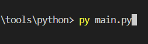

# CCF

# How to get private.json

* Gear Icon -> Project Settings -> Service Accounts -> Generate new private key

* You need a private folder if you don't already have one.

* You'll need to rename the file to "private.json".

**DO NOT PUSH THIS TO A PUBLIC GITHUB**

# Run python tool

* make sure to pip install both firebase_admin and pyinstaller

* Run the python script with py

**OR**

* First get pyinstaller by running "pip install pyinstaller" then run build.bat

* Enter the dist directory.

* Wait for batch to finish and an .exe should appear.

**DO NOT PUSH THIS TO A PUBLIC GITHUB**

# How to get .tsv

* Open Google Sheets and click on file. Hover over the download button and select TSV.

# Uploading .tsv to firebase

* Click "Add Card"

* Click "Clear Firebase and Upload TSV"

# Enable Auth (NOT REQUIRED)
This method was used for the addCard.html, but it's not required for the python script.

1. Enable authentication service on firebase. (it is separate from the realtime database)

2. Enable email only (under Sign-in method) and setup a dummy account (under users). This doesn't need to be a real email.

3. Change the realtime database rules to allow for auth users to make changes.

4. Add your information to the addCard.html. **DO NOT PUSH THIS TO A PUBLIC GITHUB**

# Git.js information
# init firebase
* Initialize firebase database
* Remember to change firebase information with new, updated one

# Functions for site

* Add all function will be called to autoload everything from the firebase server in order to show all items

* Then is one of the 4 function used to sort by interests they are all almost the same, but each detects different types

* Next is a function that if search is used, it will sort through all data and if name, type, or description match, it will pull up after searched

# Website start up

* This will run to set up all the buttons to be ready to be clicked and load all and showing all the information

* Then a button was created in order to remove the annoying mess of having to click the search icon every time, so that if you clicked enter it would load

# Add Card

* This is what will make and append the divs to the main
* First this will go through the data it was given and create the basic div template then check the data for it's type and add that to the template and set default images

* Then it will finish the base div template
* After that it will sort through and do a conditional check for how many entries there are and after getting the amount of entries it will add each on to the entry sections
* Finally append the div create to the main div this all will repeat for every item that passed the sort option the user picks through

# To Top BTN

* A simple button that will show when scrolled slightly down, it will add a fast animation by setting the scrolltop to 0

# Querry Tags

* This is used to save info to the search bar, so if the user reloaded the page it will save their search and redo it
* It was also made to be able to send the link while something is looked up and to still be the way they sent it

# Dark/light Mode

* This will invert the color of everything to make them dark or light depending what they were before they clicked the button, then set the button logo to a sun or moon

1. Sets the consts that will be set to or inverted from

2. Makes the functon to swap the colors when clicked

# Map.js Documentation 

* Currently hard-coded variables but should eventually make this auto generated
* These variables are the list of where they will be during the CCF that are the EXACT name that thay put in

* Then is a function that will take a list of where they will be and then return a html list of them
* Where each of them has an href that will reopen the get.js page, and the interest tag will be the name of the button

* Then runs function on all lists

* Then run the same thing that was said
* Start up [startup](#startup)

# Map canvas

* Now we create a html canvas and add event listeners for click and hover event to the canvas to get the x,y of clicks
* Then create an image sprite and set it to the image of the school
* As well as the buttons for the different areas, that will populate at the top of the screen and be able to be clicked to show the different booths in said area

# Map Functions

* Then create a function that will plot all the buttons on the canvas

* Then a function for mouse click/hover on the canvas buttons it will
* Check if where you clicked or hover is on top of a button
* It if is then set the buttons div that is the list of companies at that spot to show and all others to hide

# Draw canvas

* Finally a function that will draw the canvas and the buttons on the canvas
* As well as a interval that will trigger every 100ms, so that if the user resizes the screen it will also update to that and put it in the right position

* website
https://sictccs.github.io/CCF/mapView.html